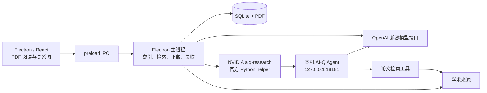

# Paper Tree

**从一篇论文出发，沿着疑问建立可回溯的阅读关系。**

Paper Tree 是一个 Electron 桌面论文阅读原型。保留 PDF 原版面，框选陌生概念或引用，由模型整理检索意图、NVIDIA `aiq-research` 获取研究依据，再查找、下载并关联下一篇论文。


## 核心流程

**导入 PDF → 框选内容 → 智能检索 → 获取论文 → 形成分支 → 返回原文**

- **原版面阅读**：连续滚动、缩放、矩形框选；检索位置保存为可点击的标记。
- **关联式探索**：关系图显示阅读分支，来源按钮返回父论文的原始位置。
- **有依据的检索**：利用主题和缓存参考文献，保留学术术语，排除自身及无关候选；可以查看 NVIDIA Agent 研究记录。
- **论文获取**：公开 PDF 尝试自动下载；需要登录时打开获取窗口，也支持手动补入文件。
- **本机工作区**：根论文筛选、节点改名、分支删除；SQLite 保存数据，PDF 独立存储。
- **中英文界面**：右上角语言选择即时生效；模型接口通过设置页面配置。

图中的连线表示用户的**探索关系**，不保证是论文间的正式引用关系。当前产品围绕检索与关联，没有聊天窗口。

## 快速开始

当前以源码运行，已在 macOS 验证；尚未提供安装包，DGX Spark 自部署推理仍待完成。

### 1. 准备环境

- Node.js **24+**、npm、Git。
- Python **3.11–3.13**、[uv](https://docs.astral.sh/uv/)：用于安装并运行本机 AI-Q 后台。
- 一个可用的 OpenAI 兼容模型接口。开发验证使用千问 `qwen-flash`。

在项目根目录执行：

```bash
npm ci
npm run setup:aiq
npm run dev
```

`setup:aiq` 会下载固定版本的 AI-Q 和依赖，首次安装可能较慢；macOS 上的上游依赖可能需要 Rust 工具链。安装与故障排查见 [NVIDIA 接入说明](docs/skills.md)。

### 2. 配置模型

打开右上角 **⚙ 设置**，填写：

| 配置 | 示例 |
| --- | --- |
| API URL | `https://dashscope.aliyuncs.com/compatible-mode/v1` |
| API Key | 你的接口密钥 |
| Model | `qwen-flash` |

URL 填基础地址，不包含 `/chat/completions`。点击 **保存并重启** 后，客户端与其启动的 AI-Q 后台使用相同配置。API Key 留空表示保留已保存值。

日常使用不需要编辑环境变量。已有 `.env` 的模型配置仅在首次创建本机设置时迁移；之后以界面保存的设置为准。语言选择位于设置图标旁，切换后立即保存，**无需重启**。

### 3. 开始阅读

1. 点击 **导入根论文**，或拖入含文字层的 PDF。
2. 等待主题与参考文献索引完成，点击底部 **箭头＋放大镜** 工具。
3. 拖出矩形框，点击框边的 **关联框内内容**。
4. 查看浮动气泡中的候选、来源与关联原因，选择获取 PDF。
5. 下载完成后生成子节点；继续探索，或点击 **回到源论文** 返回来源选区。

详细操作、英文按钮对照与截图见 [使用指南](docs/usage.md)。

## 简明架构



没有独立 Web 业务服务、外部 SQL 服务或向量数据库。Electron 会启动本机 AI-Q 伴随进程；模型推理服务是另一角色，目前可使用公开 API，后续再替换为 Spark 上的兼容接口。

[架构与数据流](docs/architecture.md) · [NVIDIA Skill 接入](docs/skills.md) · [测试与验收](docs/testing.md)

## 开发与验证

```bash
npm run dev           # 开发模式
npm run build         # 规模检查、TypeScript 检查、构建
npm start             # 构建并预览 Electron 客户端
npm test              # 工作流、存储、查询规划与 Skill 协议测试
npm run test:desktop  # 隔离的桌面回归，不使用真实模型或出版商
npm run test:api      # 真实模型 + AI-Q + 公共论文来源，会消耗 API 用量
```

`test:api` 是独立命令行工具，读取环境变量 / `.env`，不读取客户端加密保存的 Key；配置方法见 [测试说明](docs/testing.md)。

运行源码上限为 **16 文件 / 2,000 行**，源码、测试及配置合计上限为 **28 文件 / 2,900 行**；构建时检查。官方 vendored Skill 和下载的上游依赖另行管理。

## 数据与当前边界

- 数据位于 Electron `userData/workspace/`；`PAPER_TREE_DATA_DIR` 可指定独立工作区。
- 模型密钥经 Electron `safeStorage` 加密后存入 SQLite，界面不回传已保存的明文 Key。
- 本地提取 PDF 文字；首次索引会将首页发送给配置模型。检索会发送选区及必要上下文给模型与 AI-Q，短查询发往学术来源。**当前不是纯离线应用。**
- 已接入官方 NVIDIA `aiq-research`；**未完成** DGX Spark 模型部署优化、OCR、库内语义检索和安装包。
- 公开索引可能限流，模型筛选可能误判；机构登录仍需实测，学校账号并不等于通用全文 API Token。
- 同篇论文可形成重复节点；同一区域多次检索的标记可能重叠。删除分支会删除后续节点及本机 PDF 副本，请留意确认框。

截图来自当前 5 篇论文 / 4 条关联的真实工作区，阅读区展示开放的 [HorNet](https://arxiv.org/abs/2207.14284)。工作区和论文文件不随仓库分发。第三方 Skill 版本及许可证见 [vendor/nvidia-skills](vendor/nvidia-skills)。
