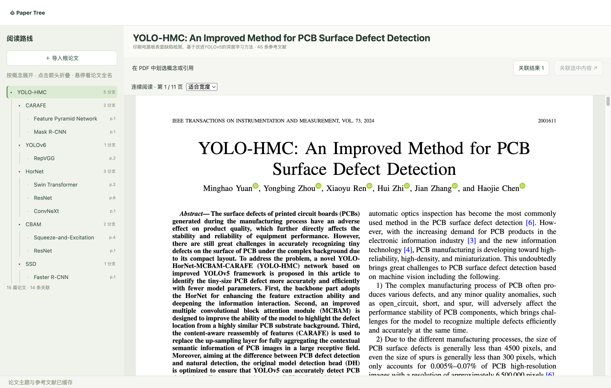

# Paper Tree

Electron 论文阅读原型：**阅读 PDF → 划选概念 → 检索关联论文 → 下载 → 建立阅读分支**。



## 启动

使用 Node.js 24+：

```bash
npm install
cp .env.example .env  # 首次配置；已有 .env 时跳过
npm run dev
```

在 `.env` 填写 `QWEN_API_KEY`，默认模型为 `qwen-flash`。可选配置 `IEEE_API_KEY` 增加 IEEE 元数据检索，它不授予付费全文权限。密钥只在主进程读取。

构建运行：`npm run build`，然后 `npm start`。当前尚未制作安装包。

## 第一版包含什么

- PDF 原版面连续滚动、缩放和文字划选。
- 主题与参考文献缓存；优先定位引用，再由模型筛选真实论文候选。
- 不改变正文宽度的结果气泡；再次划选时自动收起。
- 获取窗口登录、下载完成后自动建立关联；支持手动补入 PDF。
- 每篇一行的可折叠概念树，保留来源页码和阅读路径。

首次打开论文时会将首页发送给配置的模型提取主题；检索时发送必要的文献上下文。数据保存在 Electron 用户数据目录的 `workspace/`，包括 SQLite 和独立 PDF 文件。

## 目录

| 路径 | 用途 |
|---|---|
| `src/main/` | 本地存储、索引、检索、下载和工作流 |
| `src/renderer/` | PDF 阅读器、概念树和结果气泡 |
| `src/preload.ts`、`src/shared/` | IPC 桥接与共享类型 |
| `scripts/`、`tests/` | 规模检查、自动测试与真实接口验证 |
| `docs/` | [实现说明](docs/architecture.md)、[测试 SOP 与实测记录](docs/testing.md)、最新截图 |

`input/` 是本地活动资料与历史归档，`.prototype-data/` 是本地测试工作区；两者均不提交。构建不依赖这些本地资料。

## 验证

```bash
npm run build         # 行数/文件数限制、类型检查和构建
npm test              # 存储、关联、权限映射与引用定位
npm run test:desktop  # 本地合成 PDF 和登录页面，无需真实模型接口
npm run test:api      # 真实千问和论文检索，产生少量接口用量
```

运行源码限制为 14 文件 / 1,200 行；自有源码、测试和构建配置限制为 22 文件 / 1,800 行，由构建强制检查。

## 当前边界

NVIDIA Agent Skills 和 Spark 本地模型部署仍是项目要求，**本原型尚未完成这两项接入**。当前运行链路使用千问、arXiv / Crossref，以及可选的 IEEE 元数据接口。

扫描 PDF 暂无 OCR；候选筛选可能误判；不自动核对导入 PDF 的学术身份，不合并重复论文节点。机构登录只完成了受控浏览器测试，尚未验证真实学校身份。
