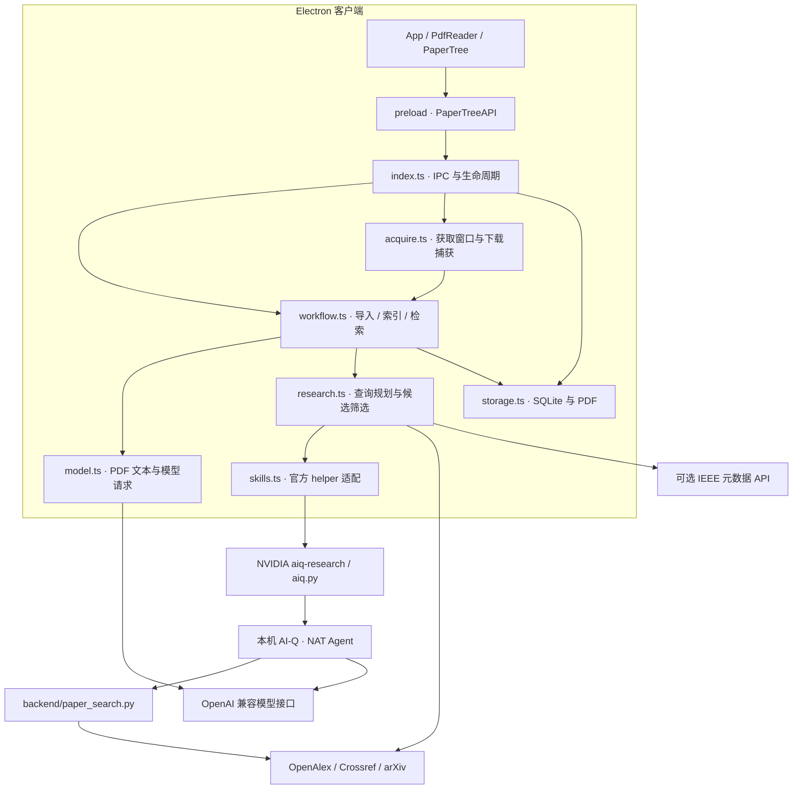
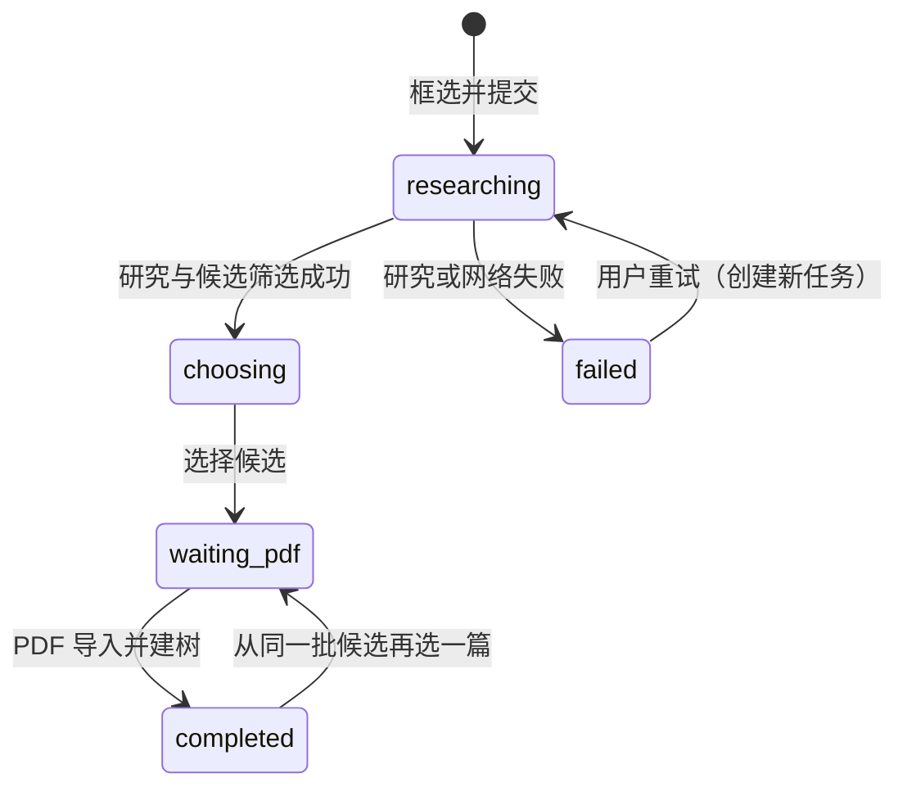

# 架构说明

[返回 README](../README.md) · [使用指南](usage.md) · [NVIDIA 接入](skills.md)

## 进程边界

Paper Tree 由桌面客户端、本机研究后台和模型服务组成。React 提供阅读界面，Electron 管理文件、工作区和下载，NVIDIA AI-Q 执行研究流程。模型可使用云端 OpenAI 兼容服务，或 DGX Spark 上的 NVIDIA TensorRT-LLM 服务。

本文面向希望了解数据流、接入模型或扩展应用的使用者。日常操作见 [使用指南](usage.md)，自部署步骤见 [模型部署](deployment.md)。



工作区使用嵌入式 SQLite，不依赖独立数据库服务。AI-Q 默认由客户端启动并绑定 `127.0.0.1:18181`；Spark 模型服务通过 SSH 隧道连接，桌面端与 AI-Q 共用同一模型接口。

## 代码导航

| 文件 | 职责 | 类型 |
| --- | --- | --- |
| `src/renderer/App.tsx` | 工作区、设置、语言、编辑和结果气泡 | React UI |
| `src/renderer/components/PdfReader.tsx` | PDF.js 连续阅读、矩形框选、标记和来源定位 | 阅读交互 |
| `src/renderer/components/PaperTree.tsx` | vis-network 关系图与论文切换 | 可视化 |
| `src/preload.ts` | `window.paperTree` IPC 桥接 | Electron |
| `src/shared/types.ts` | Paper、Relation、Task、API 类型及中英文文本选择 | 共享约定 |
| `src/main/index.ts` | 窗口、IPC、模型配置、语言偏好、删除确认、后台生命周期 | 应用入口 |
| `src/main/workflow.ts` | 导入、索引去重、研究任务、选择候选和建树 | 业务编排 |
| `src/main/storage.ts` | SQLite、PDF 文件、改名与分支删除 | 本地持久化 |
| `src/main/model.ts` | PDF 文本提取、首页主题、OpenAI 兼容请求 | 模型调用 |
| `src/main/research.ts` | 引用定位、短查询、元数据检索、去重和相关性筛选 | AI + 检索 |
| `src/main/skills.ts` | 启动 AI-Q、执行官方 helper、读取报告及版本 | NVIDIA Skill 接入 |
| `src/main/acquire.ts` | 获取窗口、持久会话、下载监听、手动导入配合 | 文件获取 |
| `backend/aiq.yml` | 模型、Agent、数据源及本地数据库配置 | AI-Q 配置 |
| `backend/paper_search.py` | 给 Agent 提供带来源的论文检索结果 | 自定义 NAT 工具 |
| `vendor/nvidia-skills/` | 固定版本的官方 Skill、helper 与许可证 | 上游组件 |
| `deploy/` | TensorRT-LLM 启动配置与接口检查 | 模型部署 |

## 一次探索的数据流

1. **导入**：`ImportInput` 携带文件名和 PDF 字节。检查文件头后写入本机，生成 `Paper`。不带 `taskId` 是根论文；带等待下载任务的 `taskId` 时生成子论文及关联。
2. **索引**：读取论文时异步建立 `PaperIndex`。PDF.js 本地提取逐页文字和编号参考文献，模型读取首页生成标题与主题；按论文 ID 缓存。索引失败不阻止阅读。
3. **框选**：从 PDF 画布截取矩形内的图片，视觉模型识别后由用户核对原文，生成 `ExpandInput`，包含论文 ID、页码、原文和相对页面的 `x/y/w/h`。
4. **查询规划**：模型结合选区与缓存参考文献生成术语和初始查询。定位原论文使用参考文献中的标题或 arXiv ID，同时独立执行概念关键词查询以寻找相关研究。
5. **官方 Skill**：`skills.ts` 调用 NVIDIA `aiq.py` 的 health/chat/status/report。AI-Q 使用论文工具生成带来源的研究报告，报告与版本信息随任务保存；调用失败时保留独立学术索引返回的结果并说明失败。
6. **候选筛选**：通过学术元数据接口获得真实候选，去掉自身和重复结果；接入 AI-Q 报告中的 arXiv 与 DOI 链接并查询元数据。模型逐篇给出与选区的相关性评分和原因，全部候选按评分从高到低展示；同分保留检索顺序。模型不删选候选，不设置结果数量目标，不按数量追加检索。漏评直接报错。各来源返回数量和失败情况随检索记录保存。
7. **获取与建树**：用户选择候选后任务进入 `waiting-pdf`。获取窗口下载成功或手动补入 PDF 后，保存子论文和 `Relation`，任务变为 `completed`。



数据库中的等待状态实际名称是 `waiting-pdf`。仅访问网页不完成任务；下载失败时保留等待状态，供重新下载或手动补入。

## 本地数据

默认目录为 `app.getPath("userData")/workspace`；设置 `PAPER_TREE_DATA_DIR` 时，工作区直接使用该目录，Electron 会话数据也使用这个 userData 位置。

```text
工作区目录/
├── workspace.sqlite
│   ├── state        # 论文、关联和研究任务的 JSON
│   ├── paper_index  # 每篇论文的标题、主题、页文本和参考文献
│   └── settings     # URL、模型名、加密 Key、语言
└── papers/<paper-id>.pdf
```

- `Paper` 是一个阅读节点；同一论文经不同路径导入仍可生成多个节点。
- `Relation` 保存 sourceId、targetId、来源页码、原文和矩形。它表示探索关系，不自动证明学术引用。
- `Task` 保存选区、计划、候选、选中项、状态及 `SkillRun`；后者含报告、版本号、地址、时间和可能的 job ID。
- 改名只改变显示标题，并标记 `renamed`；不改原始索引。删除按后续分支级联处理，保留父论文上的检索记录。

## 配置、语言和生命周期

首次创建设置时迁移环境变量；以后本机设置优先。API Key 用 Electron `safeStorage` 加密，renderer 只收到 `hasKey`，不收到已保存的明文 Key。保存 API 配置会重启，确保主进程和新启动的 AI-Q 使用同一配置。

语言选择是单独 IPC，立即写入设置并更新 renderer 和主进程文案，不重启模型后台。翻译文本与代码就近维护，PDF、原始标题和已有生成内容不被自动翻译。

AI-Q 启动目录由 `AIQ_REPO` 指定，默认 `.prototype-data/aiq`。应用只停止自己启动的进程；指定 `AIQ_SERVER_URL` 连接已有本机后台时，其生命周期和模型环境由启动者管理。

获取窗口使用独立持久会话 `persist:paper-acquisition`，仅捕获该窗口触发的下载。系统浏览器下载需要手动补入；不把学校网页登录 Cookie 转换为通用 Token。
