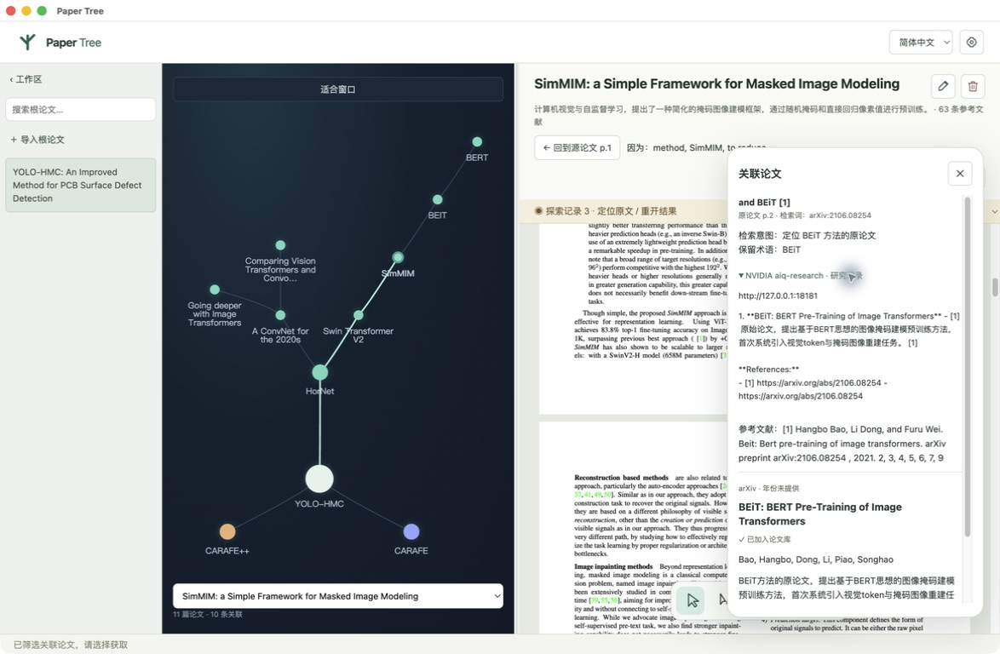

# Agent Skills 设计与集成

[返回 README](../README.md) · [架构说明](architecture.md) · [模型部署](deployment.md)

Paper Tree 使用 NVIDIA 官方 **`aiq-research`** Skill，为选中的论文内容生成带来源的研究报告。每次关联检索都会调用该流程，报告可在候选面板的「研究记录」中查看。

## 设计：把研究能力接入一次阅读操作

Skill 的入口是用户在 PDF 中确认的选区。应用先用视觉模型识别截图，再结合论文主题与缓存引用整理研究目标，保留方法名、学术术语和参考文献线索。`aiq-research` 接收这些研究数据，在 NVIDIA AI-Q 后台执行研究；PDF 交互、截图识别、候选排序和下载建树由应用的相应模块承担。

本项目复用 [官方 SKILL.md](../vendor/nvidia-skills/aiq-research/SKILL.md) 与其 [Python helper](../vendor/nvidia-skills/aiq-research/scripts/aiq.py)，由 Electron 适配层按明确步骤调用。集成方式是将官方 Skill 的调用协议接入产品流程，并固定上游版本。Paper Tree 编写的 `paper_search` 是注册到 NAT 的领域工具：它为 AI-Q 提供论文数据源，和官方 Agent Skill 是不同层次的组件。

选择 NVIDIA AI-Q 的作用在于将研究 Agent、模型和数据源组织为可配置流程。应用把当前阅读问题传给研究后台，后台调用论文工具并组织带引用的报告；模型从云端接口切换到 Spark 上的 TensorRT-LLM 时，沿用相同的 Skill 调用入口和论文工具。

## 如何参与论文检索

```text
框选截图 → 视觉模型识别原文 → 模型整理检索目标 → NVIDIA aiq-research
→ 本机 AI-Q 调用论文搜索工具 → 生成带来源的报告
→ 检索候选并筛选相关性 → 选择、下载和关联
```

论文搜索工具使用 OpenAlex、Crossref 和 arXiv。模型负责理解选区与评估相关性，候选标题和获取地址来自学术来源。每次成功研究会保存 Skill 版本、报告和调用时间，便于回看探索依据。

研究与直接学术索引查询并行执行。报告中的 arXiv 和 DOI 链接会再次查询元数据，与索引结果一起去重、排除当前论文，然后逐篇评估相关性；候选数量由来源结果决定。若 AI-Q 研究未完成，应用明确标注状态，保留学术索引结果，不将其标为成功的 Skill 报告。

## 调用与研究配置

1. Electron 确认本机 AI-Q 就绪，通过官方 helper 执行 `health`。
2. 将检索意图、查询词与保留术语传入 `chat`。研究提示要求真实论文来源、作者年份和简短关联依据。
3. AI-Q 使用 `backend/aiq.yml` 中的模型与论文数据源执行研究。当前采用同步流程，关闭自动升级与反问；浅层研究配置启用来源引用，最多 5 轮模型调用、3 次工具迭代。
4. 接收带来源 URL 的报告；若后台返回异步 job ID，适配层通过 `status` 和 `report` 获取结果。
5. 将报告、Skill 固定版本、调用时间及任务 ID（如有）保存到研究任务。用户在候选面板展开研究记录即可查看。

这一流程将检索依据与阅读节点保存在一起。返回原文时，用户可以同时找到当时的选区、候选论文和研究来源。



## 组件与来源

| 组件 | 作用 |
| --- | --- |
| NVIDIA `aiq-research` | 官方 Skill 说明与 Python helper |
| NVIDIA AI-Q | 运行研究 Agent，调用工具并处理来源引用 |
| `backend/aiq.yml` | 配置模型、研究流程与论文数据源 |
| `backend/paper_search.py` | Paper Tree 提供的 NAT 论文检索工具 |
| `src/main/skills.ts` | 连接桌面应用、官方 helper 与本机 AI-Q |

Skill 固定版本为 `d8519c57da6db5d9bea274ec1724a4a7a56a3dee`，AI-Q 固定版本为 `bf4e67d1564ef8d2ec8f65b5f9001e512befc095`。官方文件与 [Apache-2.0](../vendor/nvidia-skills/LICENSE-APACHE)、[CC-BY-4.0](../vendor/nvidia-skills/LICENSE-CC-BY-4.0) 许可证保存在 [vendor/nvidia-skills](../vendor/nvidia-skills)。

上游项目：[NVIDIA/skills](https://github.com/NVIDIA/skills) · [AI-Q Blueprint](https://github.com/NVIDIA-AI-Blueprints/aiq)。

## 安装与运行

准备 Git、Node.js 24+、Python 3.11–3.13 和 uv，在项目目录执行：

```bash
npm ci
npm run setup:aiq
npm run build
npm start
```

安装脚本获取固定版本 AI-Q、安装依赖并注册论文搜索工具。macOS 上构建部分上游依赖可能需要 Rust 工具链。默认安装位置为 `.prototype-data/aiq/`，其中的源码、Python 环境和任务数据库属于应用运行依赖。

应用启动本机 AI-Q，并绑定 `127.0.0.1:18181`。首次使用请在应用设置中填写模型配置，然后保存并重启。模型需支持 OpenAI 兼容聊天接口、JSON 输出与工具调用；[Spark 部署配置](deployment.md) 已支持 Qwen3.8-27B 和 Qwen3.5-9B。

## 高级配置

正常使用可直接通过界面配置模型。需要复用已有 AI-Q 安装或管理后台进程时，可使用以下环境变量：

| 环境变量 | 作用 |
| --- | --- |
| `AIQ_REPO` | 固定版本 AI-Q 仓库路径，默认 `.prototype-data/aiq` |
| `AIQ_PYTHON` | 执行 helper 的 Python，默认 AI-Q 的 `.venv/bin/python` |
| `AIQ_SERVER_URL` | 连接已有本机 AI-Q，应用不再管理其启动与停止 |
| `PAPER_TREE_DEBUG` | 设为 `1` 时输出自启 AI-Q 日志 |
| `UV` | 安装脚本使用的 uv 可执行文件 |
| `IEEE_API_KEY` | 可选的 IEEE 元数据接口密钥，不提供全文订阅权限 |

已有 AI-Q 后台需要单独配置模型；桌面应用保存设置不会更新外部管理的后台。当前只支持回环地址上的 AI-Q 服务。

## 常见问题

**提示 AI-Q 未安装**：在项目根目录运行 `npm run setup:aiq`。如果提示版本不匹配，请检查 `AIQ_REPO` 是否指向所需版本。

**后台无法启动**：确认模型配置完整、Python 环境可用，以及 18181 端口没有被其他进程占用。可通过 `PAPER_TREE_DEBUG=1 npm start` 查看启动日志。日志可能包含研究内容，分享前请检查其中的信息。

**模型接口可用，但研究失败**：除普通聊天外，研究流程还要求结构化输出和工具调用。使用 Spark 时可运行 `python3 deploy/smoke.py` 检查接口，或查看 AI-Q 日志定位问题。

**检索来源超时或限流**：稍后重试，或缩小选区。检索接口错误不代表论文全文需要付费。

可复现的论文探索流程见 [示例与验证](testing.md)。
