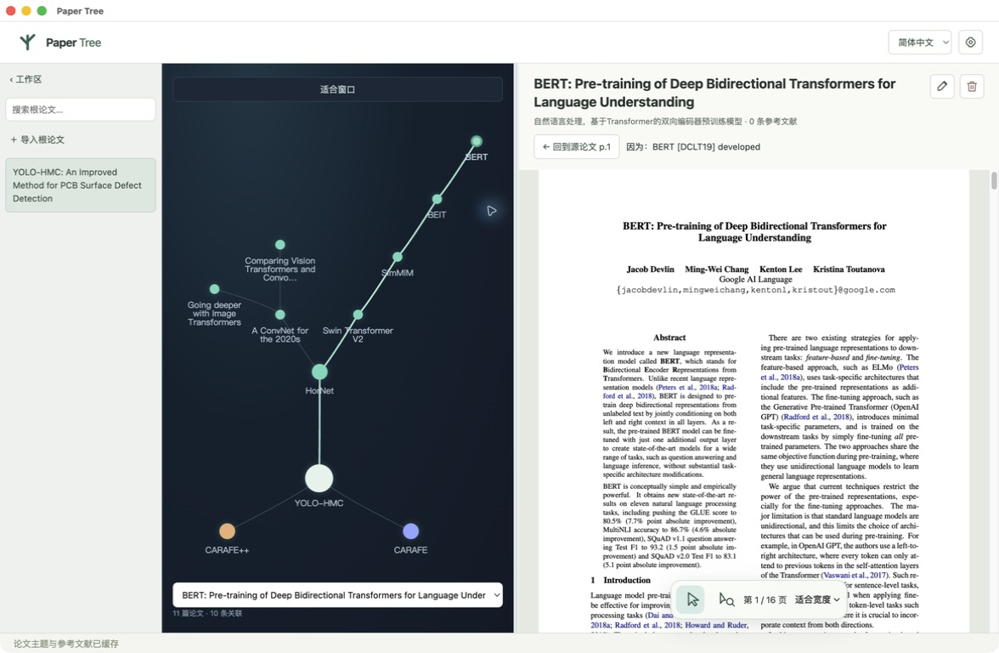

# 示例与验证

[返回 README](../README.md) · [使用指南](usage.md) · [模型部署](deployment.md)

## 用公开论文开始

下载 [HorNet](https://arxiv.org/abs/2207.14284) 的 PDF 并导入 Paper Tree。等待索引完成后，框选首页的 `ConvNeXt`，点击「关联框内内容」，在候选中查找 *A ConvNet for the 2020s*。获取全文后，关系图会出现新节点；点击「回到源论文」可以返回 HorNet 中的选区。

以下示例适合体验不同阅读路径。页码与引用编号可能随 PDF 版本变化，候选顺序也可能随模型和公开索引更新。

| 源论文 | 框选内容 | 可查找的相关论文 |
| --- | --- | --- |
| [HorNet](https://arxiv.org/abs/2207.14284) | 首页 `ConvNeXt` | [A ConvNet for the 2020s](https://arxiv.org/abs/2201.03545) |
| [Swin Transformer V2](https://arxiv.org/abs/2111.09883) | 首页 `SimMIM` | [SimMIM](https://arxiv.org/abs/2111.09886) |
| [SimMIM](https://arxiv.org/abs/2111.09886) | 第 2 页 `BEiT [1]` | [BEiT](https://arxiv.org/abs/2106.08254) |
| [BEiT](https://arxiv.org/abs/2106.08254) | 首页 `BERT` | [BERT](https://aclanthology.org/N19-1423/) |
| [CARAFE](https://arxiv.org/abs/1905.02188) | 首页 `Feature Pyramid Network` | [Feature Pyramid Networks for Object Detection](https://arxiv.org/abs/1612.03144) |

## 多层阅读示例

下面的关系图来自 Electron 客户端中的实际检索与下载，包含 11 篇论文、10 条关联。根论文为 *YOLO-HMC: An Improved Method for PCB Surface Defect Detection*（DOI：`10.1109/TIM.2024.3351241`）；也可以导入上述任一公开论文，从对应分支开始。

```text
YOLO-HMC
├─ HorNet
│  ├─ A ConvNet for the 2020s
│  │  ├─ Going deeper with Image Transformers
│  │  └─ Comparing Vision Transformers and Convolutional Neural Networks…
│  └─ Swin Transformer V2
│     └─ SimMIM
│        └─ BEiT
│           └─ BERT
├─ CARAFE
└─ CARAFE++
```



该示例于 2026-09-28 验证：最初三篇使用 Qwen3.5-9B，随后切换到 DGX Spark 上的 Qwen3.8-27B，新增八篇。验证覆盖直接获取 PDF、出版商网页下载、PDF 查看器下载、返回来源选区及重启后恢复数据。论文文件需自行获取，示例工作区不随仓库分发。

## 检查自己的模型配置

连接 Spark 推理服务后，可在项目目录运行：

```bash
python3 deploy/smoke.py
```

该命令检查模型发现、JSON 输出和工具调用往返。工具结果使用固定数据；要验证实际检索与下载，请在应用中完成上面的公开论文示例。参数见 [部署指南](deployment.md)。

模型与网络配置正确时，应能看到候选标题、来源和研究记录，下载后生成子节点，返回原文后看到已关联的选框。公开来源限流或下载失败时，可稍后重试，或下载有权访问的 PDF 后手动补入。

## 源码验证命令

以下命令供从源码运行、修改或集成 Paper Tree 的使用者检查环境：

| 命令 | 用途 |
| --- | --- |
| `npm run dev` | 启动开发模式 |
| `npm run build` | 检查代码规模、TypeScript 并构建应用 |
| `npm start` | 启动已构建的 Electron 应用 |
| `npm test` | 验证存储、框选处理、查询规划、相关性排序与官方 Skill helper 协议 |
| `npm run test:desktop` | 在独立临时工作区运行桌面回归，使用模拟模型、出版商和合成 PDF |
| `npm run test:api` | 调用真实模型、AI-Q 与公开论文来源 |

`test:api` 从进程环境或 `.env` 读取 `QWEN_BASE_URL`、`QWEN_API_KEY` 和 `QWEN_MODEL`，不读取客户端加密保存的密钥。可参考 `.env.example` 配置，并先运行 `npm run setup:aiq`。

```bash
npm run test:api
# 可选：使用本地 PDF 检查索引与研究流程
npm run test:api -- "/absolute/path/to/YOLO-HMC.pdf"
```

默认测试使用公开书目信息；指定 PDF 时会将首页和必要上下文发送给配置的模型，可能产生 API 费用。桌面模拟测试不验证真实学校 SSO；机构访问需要使用自己的订阅账号在对应站点确认。
