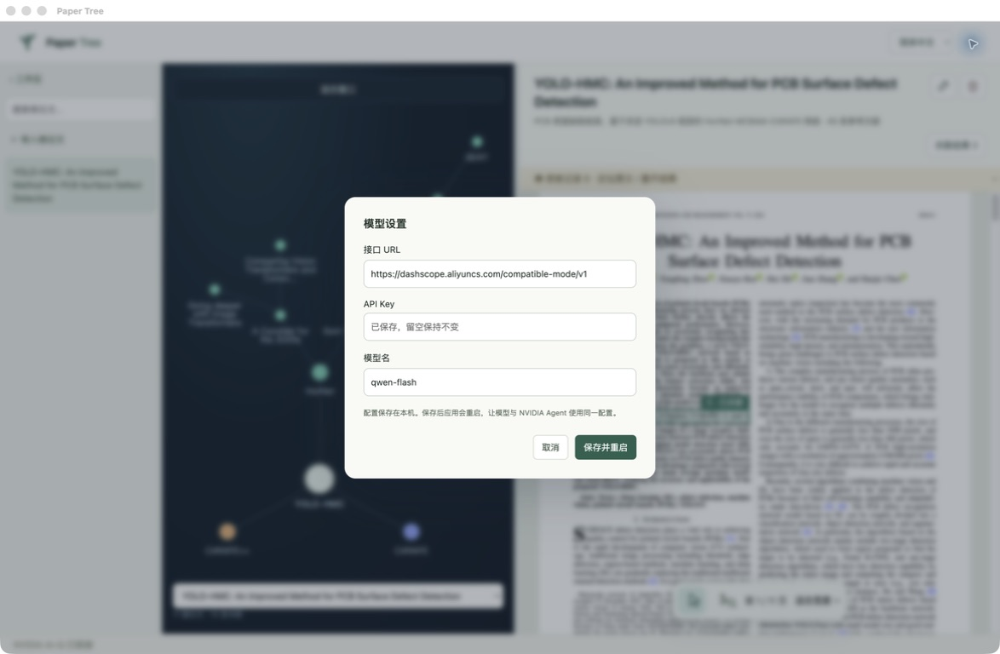
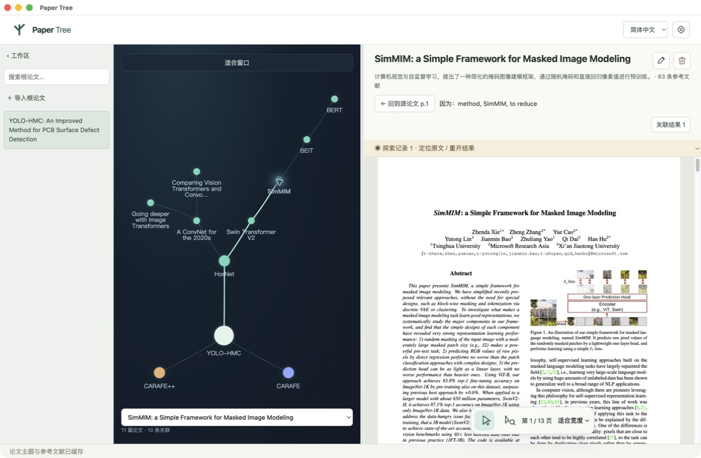
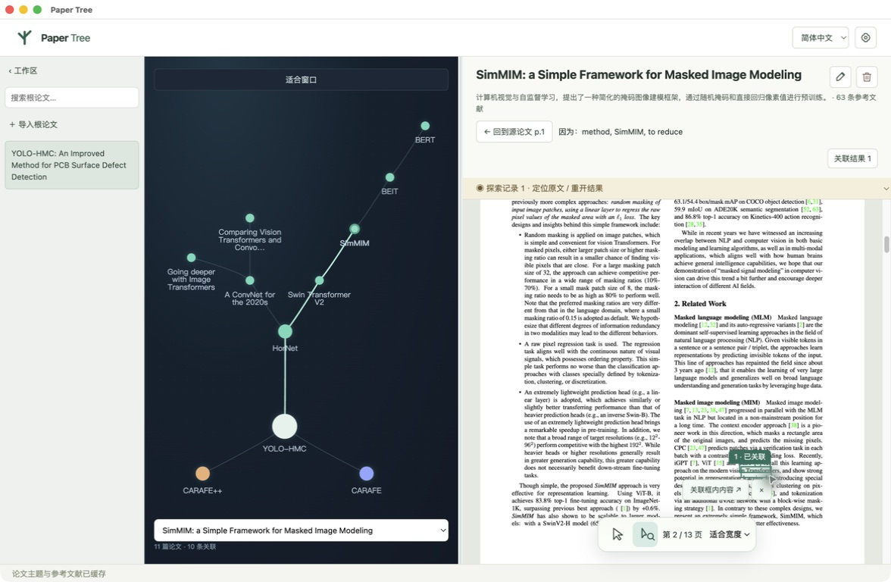
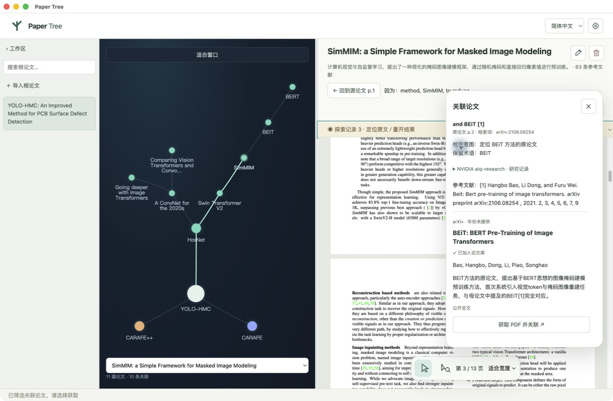
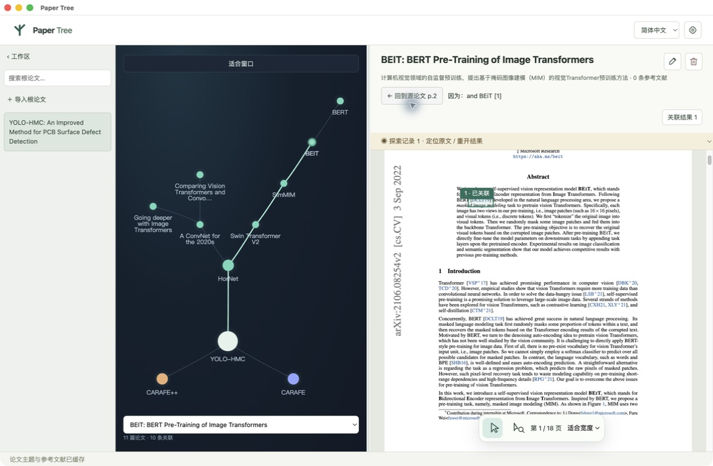

# 使用指南

[返回 README](../README.md) · [模型部署](deployment.md) · [阅读示例](testing.md)

## 1. 配置模型与语言

点击右上角齿轮，填写 OpenAI 兼容基础 URL、API Key 和模型名，然后点击「保存并重启」。可连接云模型，也可按照 [Spark 部署指南](deployment.md) 使用自己的推理服务。密钥留空会保留原值。

语言选择在齿轮旁边，支持简体中文和 English，切换立即生效并保存，无需重启。PDF、论文标题和已有研究记录保留原有语言。

首次启动尚未配置模型时，仍可阅读 PDF；索引和研究需要可用模型及 AI-Q。安装步骤见 [README](../README.md#开始使用)。

## 2. 导入与阅读

- 「导入根论文」创建一个工作区；也可把含文字层的 PDF 拖进阅读区。
- 最左侧只列根论文，搜索框按标题、主题或文件名筛选已有工作区，不是联网找论文。
- 中间关系图和底部论文选择器负责切换当前工作区内的论文。
- 右侧连续滚动 PDF；底部普通箭头是阅读模式，可调整缩放。
- 拖动中间分隔线调整关系图与 PDF 宽度；关系图可拖动节点、缩放或「适合窗口」。

首次读取会提取页文本和参考文献，并调用模型生成标题和主题。请等待索引完成后再框选，避免页面布局更新影响尚未提交的选区。索引失败时 PDF 仍可阅读，可检查模型配置和网络连接后重试。

## 3. 框选并搜索

1. 点击底部工具栏的「箭头＋放大镜」，进入框选模式。
2. 在同一页上拖出矩形，尽量覆盖完整的方法名、概念描述或引用编号。
3. 松开后检查选框，点击框边「关联框内内容」。
4. 模型先整理检索意图、保留学术术语，再经过 NVIDIA `aiq-research` 和学术来源检索、筛选候选。

切回普通箭头或清除选框可取消尚未提交的选择。框选后会截取框内画面并交给视觉模型识别。检查弹框中的截图和原文，可以修改识别文字，再点击关联。原文标记上的 × 可删除该次检索标记，已关联的论文仍保留。

建议从 `HorNet`、`ConvNeXt` 等明确方法名开始，避免框入大段无关内容。操作示例与目标论文见 [公开论文示例](testing.md#用公开论文开始)。

## 4. 查看结果、下载并关联

浮动气泡展示选区、检索词、意图、候选标题、来源和关联原因。展开「NVIDIA aiq-research · 研究记录」可查看 Agent 报告。展开「检索来源与筛选统计」可以查看来源返回数量、请求失败及筛选数量。每条显示模型给出的相关性评分，结果由高到低排列。气泡不会挤压正文宽度；关闭后可通过「关联结果」重新打开。

| 获取情况 | 操作 | 何时生成节点 |
| --- | --- | --- |
| 有公开 PDF 地址 | 点击「选择并关联」 | 应用捕获下载，完成后导入 |
| 页面打开了 PDF 查看器 | 点击查看器中的下载按钮 | 捕获 PDF 下载并完成后 |
| 需要机构访问 | 在获取窗口完成登录，再点出版商 PDF 下载入口 | 捕获到实际 PDF 下载并完成后 |
| 获取窗口无法使用 | 用系统浏览器下载，再选择「手动补入 PDF」 | 选择本地文件并导入后 |

仅打开网页不会建立节点。应用只捕获自身获取窗口的下载，不监听整个电脑或系统浏览器的下载目录。下载内容不是 PDF 时会报错。

网络超时或来源限流不代表论文必然收费。可稍后重试，或从有权访问的来源下载后手动补入。学校账号的登录方式取决于出版商和学校；IEEE 元数据 API Key 不等于全文订阅凭据。

## 5. 回溯、继续探索和编辑

- 下载完成后，目标论文成为子节点，关联保存来源选区与页码。
- 点击「回到源论文 p.…」，返回父论文并定位原选框。
- 已检索的区域保留编号标记，点击可定位并查看结果；失败记录可以重试。
- 在子论文中再次框选，可继续扩展二级、三级分支。
- 标题旁的铅笔修改显示标题；检索索引中的原始论文标题保持不变。
- 垃圾桶删除当前节点；若存在后续节点，确认框会显示数量。确认后删除该分支、关联、对应索引和本机 PDF 副本，原始导入文件不受影响。

普通阅读位置在当前运行期间记忆；论文、关系、检索框和索引在重启后继续保留。通过「探索记录」可以选择并重开之前的检索。

## 中英文按钮对照

| 中文 | English |
| --- | --- |
| 导入根论文 | Import root paper |
| 阅读浏览 / 框选检索 | Read / Area search |
| 关联框内内容 | Find related papers |
| 关联结果 | Related papers |
| 获取 PDF 并关联 | Get PDF and link |
| 手动补入 PDF | Import downloaded PDF |
| 回到源论文 | Back to source |
| 修改标题 / 删除节点 | Rename paper / Delete paper |
| 保存并重启 | Save and restart |

本页截图展示公开论文的阅读过程。更多分支示例见 [多层阅读示例](testing.md#多层阅读示例)。
